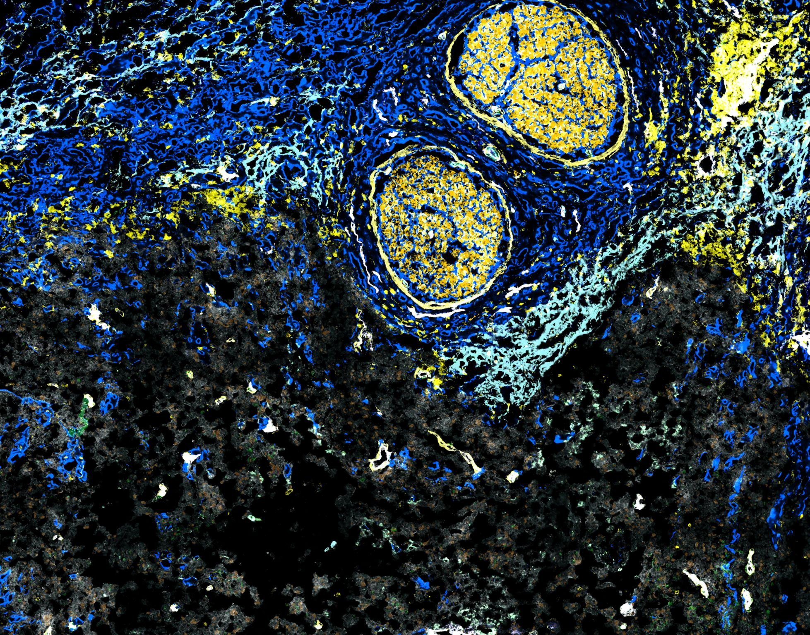

This repository consists of the preprocessing and downstream analysis scripts of the NUT Carcinoma MICS dataset, in collaboration between the Seitz and Schapiro groups at the Univeristy Hospital Tuebingen and University Hospital Heidelberg in Germany.




## Overview

This is, to our knowledge, the first spatial immune profiling study of NUT carcinoma. Using a 72-marker MICS panel across a 13-patient FFPE cohort, we characterize the tumor immune microenvironment (TIME), with a focus on:

- Immune cell composition and the immunosupressive phenotype
- Spatial niche organization (including first-reported TLS-like structures in NC) 
- MDSC–CD8⁺ T cell spatial neighor preference 
- The association of the spatial and non-spatial features with clinical outcome

## Data

Relevant data is deposited to [TBD]: [TBD]

This includes:

- pre-processed images, as of the output of MACS iQ viewer
- the phenotyping labels, as of the output of the phenotyping process
- Processed single-cell table as .h5ad and .csv files

If you have any data-related questions, please contact the corresponding authors for access.

## Environment

Analysis environments are managed with [pixi](https://pixi.sh), combining Python  and R. Each directory contains a separate pixi workspace member with its own environment for analysis or figure rendering

```bash
pixi install
```

## Processing workflow

All paths need to be adjusted to the github repo and locally stored files


## Pipeline

The analysis broadly follows this order:

1. **`preprocessing/`** — QC, marker normalization, construction of the unified `AnnData` object
2. **`proportions/`** — Cell type composition profiling (CLR transformation, two-stage ROI → patient aggregation)
3. **`niches_clustering/`** — Spatial neighborhood clustering and biological niche annotation (e.g. Granulocytic, TLS-like, Immunosuppressive myeloid, Myofibroblast, Vascular/stromal)
4. **`spatial_distance/`** — Nearest-neighbor distances and tumor contour distance analyses
5. **`cozi/`** — Neighborhood enrichment scoring (NEP) and MDSC–CD8⁺ T cell spatial co-localization via Delaunay triangulation
6. **`survival_analysis/`** — Cox regression and Kaplan-Meier analyses linking spatial/compositional features to patient outcomes
7. **`figures/`** — Assembly of all manuscript and supplementary figures

## Manuscript

["TBD]